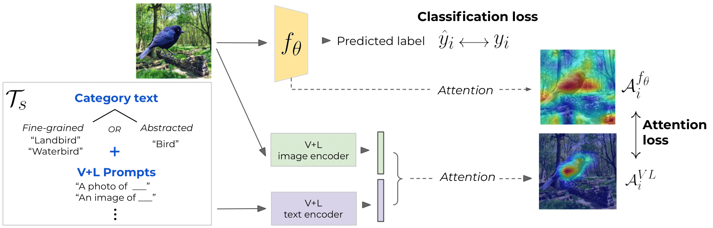

# GALS: Guiding Visual Attention with Language Specification


This is the official implementation for the CVPR 2022 paper [On Guiding Visual Attention with Language Specification](https://openaccess.thecvf.com/content/CVPR2022/papers/Petryk_On_Guiding_Visual_Attention_With_Language_Specification_CVPR_2022_paper.pdf) by Suzanne Petryk*, Lisa Dunlap*, Keyan Nasseri, Joseph Gonzalez, Trevor Darrell, and Anna Rohrbach.

If you find our code or paper useful, please cite:
```
@article{petryk2022gals,
  title={On Guiding Visual Attention with Language Specification},
  author={Petryk, Suzanne  and Dunlap, Lisa and Nasseri, Keyan and Gonzalez, Joseph and Darrell, Trevor and Rohrbach, Anna},
  journal={Conference on Computer Vision and Pattern Recognition (CVPR)},
  year={2022}
}
```

## Setting up Environment

**Conda**
```
conda env create -f env.yaml
conda activate gals
```

**Pip**
```
pip install -r requirements.txt
```

## Download Datasets
Please see the original dataset pages for further detail:
* **Waterbirds**
    * Waterbirds-95%: The [original dataset page](https://github.com/kohpangwei/group_DRO) includes instructions on how to generate different biased splits. Please download Waterbirds-95% from the link for `waterbird_complete95_forest2water2` on their page.
    * Waterbirds-100%: We use the script from [Sagawa & Koh et al.](https://github.com/kohpangwei/group_DRO) to generate the 100% biased split. For convenience, we supply this split of the dataset here: [Waterbirds-100%](https://drive.google.com/file/d/1zJpQYGEt1SuwitlNfE06TFyLaWX-st1k/view?usp=sharing).
* **Food101**: [Original dataset page](https://data.vision.ee.ethz.ch/cvl/datasets_extra/food-101/). Please download the images from the original dataset page. We construct the 5-class subset for Red Meat with images from the page.
* **MSCOCO-ApparentGender**: [Original dataset page](https://cocodataset.org/#download). Please use the original dataset page to download the COCO 2014 train & validation images and annotations. We base MSCOCO-ApparentGender on the dataset used in [Women Also Snowboard](https://github.com/kayburns/women-snowboard/tree/master/research/im2txt) (by Burns & Hendricks et al.). We modify the training IDs slightly, yet keep the same evaluation set. Please download the files about the splits here: [MSCOCO-ApparentGender](https://drive.google.com/file/d/1d17W4EglP2lBly4vtD_n01fsBGBgLwTj/view?usp=sharing).

The data is expected to be under the folder `./data`. More specifically, here is the suggested data file structure:
- `./data`
    - `waterbird_complete95_forest2water2/` (Waterbirds-95%)
    - `waterbird_1.0_forest2water2/` (Waterbirds-100%)
    - `food-101/` (Red Meat)
    - `COCO/`
        - `annotations/` (COCO annotations from original dataset page)
        - `train2014/` (COCO images from original dataset page)
        - `val2014/` ( COCO images from original dataset page)
        - `COCO_gender/` (ApparentGender files we provided)


## Repo Organization
- [`main.py`](main.py) is the point of entry for model training.
- [`configs/`](configs/) contains `.yaml` configuration files for each dataset and model type.
- [`extract_attention.py`](extract_attention.py) is the script to precompute attention with CLIP ResNet50 GradCAM and CLIP ViT transformer attention.
- [`approaches/`](approaches/) contains training code. [approaches/base.py](approaches/base.py) is for general training, and is extended by model-specific approaches such as [approaches/abn.py](approaches/abn.py), or datasets requiring extra evaluation (such as `approaches/coco_gender.py`).
- [`datasets/`](datasets/) contains PyTorch dataset creation files.
- [`models/`](models/) contains architectures for both vanilla and ABN ResNet50 classification models.
- [`utils/`](utils/) contains helper functions for general training, loss and attention computation.

This repo also expects the following additional folders:
- `./data`: contains the dataset folders
- `./weights`: contains pretrained ImageNet ResNet50 weights for the ABN model, named `resnet50_abn_imagenet.pth.tar`. These weights are provided by Hiroshi Fukui & Tsubasa Hirakawa from [their codebase](https://github.com/machine-perception-robotics-group/attention_branch_network).
For convenience, you may also find the weights with the correct naming [here](https://drive.google.com/file/d/12ca2mlKWeft-VNsjsFnhkxNnb2XyzfbZ/view?usp=sharing).

We use [Weights & Biases](https://wandb.ai/site) to log experiments. This requires the user to be logged in to a (free) W&B account. Details to set up an account [here](https://docs.wandb.ai/quickstart).

## Training & Evaluation

Training models using GALS is a 2 stage process:
1.  Generate and store attention per image
2.  Train model using attention

Example commands training networks with GALS as well as the baselines within the paper are below. 

*NOTE:* To change `.yaml` configuration values on the command line, add text of the form `ATTRIBUTE.NESTED=new_value` to the end of the command. For example:
```
CUDA_VISIBLE_DEVICES=0 python main.py --config configs/waterbirds_100_gals.yaml DATA.BATCH_SIZE=96
```

### Stage 1: Generate Attention

Important files:
- [`extract_attention.py`](extract_attention.py) is the script to precompute attention with CLIP ResNet50 GradCAM and CLIP ViT transformer attention.
- [`configs/`](configs/) includes configuration files for precomputing attention (relevant files should end in `_attention.yaml`).
- [`CLIP/`](CLIP/) contains a slightly modified copy of [OpenAI's CLIP repository](https://github.com/openai/CLIP). It is drawn directly from [Hila Chefer's repository](https://github.com/hila-chefer/Transformer-MM-Explainability/tree/main/CLIP) on computing transformer attention.
- [`Visualize_VL_Attention.ipynb`](notebooks/Visualize_VL_Attention.ipynb) visualizes attention for users to play around with different VL models/language specification.

Sample command:
```
CUDA_VISIBLE_DEVICES=0 python extract_attention.py --config configs/coco_attention.yaml
```

### Stage 2: Train model
Important files:
- [`approaches/base.py`](approaches/base.py) is where most of the training code is.
- [`configs/`](configs/) includes configuration files for model training.

The model configs include the hyperparameters and attention settings used to reproduce results in our paper.

An example command to train a model with GALS on Waterbirds-100%:
```
CUDA_VISIBLE_DEVICES=0,1,2 python main.py --name waterbirds100_gals --config configs/waterbirds_100_gals.yaml
```
The `--name` flag is used for Weights & Biases logging. You can add `--dryrun` to the command to run locally without uploading to the W&B server. This can be useful for debugging.

### Model evaluation
To evaluate a model on the test split for a given dataset, simply use the `--test_checkpoint` flag and provide a path to a trained checkpoint. For example, to evaluate a Waterbirds-95% GALS model with weights under a `trained_weights` directory
```
CUDA_VISIBLE_DEVICES=0 python main.py --config configs/waterbirds_95_gals.yaml --test_checkpoint trained_weights/waterbirds_95_gals.ckpt
```
Note: For MSCOCO-ApparentGender, the `Ratio Delta` in our paper is `1-test_ratio` in the output results.

## Checkpoints/Results
In our paper, we report the mean and standard deviation over 10 trials. Below, we include a checkpoint from a single trial per experiment.

*Waterbirds 100%*
| Method | Per Group Acc (%) | Worst Group Acc (%) |
| ----------- | ----------- | ----------- |
| [*GALS*](https://drive.google.com/file/d/1ch-gh2XuIPN_mW9sQFpkVMNStR_rpTpQ/view?usp=sharing) | 80.67 | 57.00 |
| [Vanilla](https://drive.google.com/file/d/196EEPZ9ToSPefwvOiDcuH2HZcMgipwr_/view?usp=sharing)   | 72.36 | 32.20 |
| [UpWeight](https://drive.google.com/file/d/1dXMkG3wyVU_s4WNa42TRTbF9MhVMLnZm/view?usp=sharing) | 72.22 | 37.29 |
| [ABN](https://drive.google.com/file/d/1_UR4YUqwwRUHOZ4OxNjfHQMa5qyk-y2N/view?usp=sharing)   |  71.96 | 44.39 |

*Waterbirds 95%*
| Method | Per Group Acc (%) | Worst Group Acc (%) |
| ----------- | ----------- | ----------- |
| [*GALS*](https://drive.google.com/file/d/1t7b_24rXoKKx8UI8m1If5RqMvqPs-KX2/view?usp=sharing)      | 89.03 | 79.91 |
| [Vanilla](https://drive.google.com/file/d/1uCW1bI4eztBviYqUs4W2pJUI47c_YP4r/view?usp=sharing)   | 86.91 | 73.21 |
| [UpWeight](https://drive.google.com/file/d/17t3xIvtEJv4DLjW5208vcwMuUe-AYb2R/view?usp=sharing) | 87.51 | 76.48 |
| [ABN](https://drive.google.com/file/d/1nknUUhWHLADGlu-pOcGHnaswc00ZUC7y/view?usp=sharing)   |  86.85 | 69.31 |

*Red Meat (Food101)* 
| Method | Acc (%) | Worst Group Acc (%) |
| ----------- | ----------- | ----------- |
| [*GALS*](https://drive.google.com/file/d/1gKjJ9sj6fSLJVx4oqyjO669uEzFFTpJh/view?usp=sharing)     | 72.24 | 58.00 |
| [Vanilla](https://drive.google.com/file/d/1-uAEm1CcOMriN5KccoYXAb74ckcTZM_v/view?usp=sharing)   | 69.20 | 48.80 |
| [ABN](https://drive.google.com/file/d/1v2dK8liDRI69OdZep3UCBlr_lMk69ErG/view?usp=sharing)   | 69.28 | 52.80 |

*MSCOCO-ApparentGender*
| Method | Ratio Delta | Outcome Divergence |
| ----------- | ----------- | ----------- |
| [*GALS*](https://drive.google.com/file/d/1Rdlg9qFfRDlAkCVGRYuCFRAhwTTglqst/view?usp=sharing) | 0.160 | 0.022 |
| [Vanilla](https://drive.google.com/file/d/1M9VkW4ZJrKDjT7hGHafgmyPVVzdelOWJ/view?usp=sharing) | 0.349 | 0.071 |
| [UpWeight](https://drive.google.com/file/d/1riSUI1ULwLmloC4cnfNh0mdbbkh65eQq/view?usp=sharing) | 0.272 | 0.040 |
| [ABN](https://drive.google.com/file/d/1PGf7-0UPL8BePOJpBa9WWGZtNrItjrjk/view?usp=sharing) | 0.334 | 0.068 |


## Acknowledgements

We are very grateful to the following people, from which we have used code throughout this repository that is taken or based off of their work:
- Hila Chefer, Shir Gur, Lior Wolf: [`https://github.com/hila-chefer/Transformer-MM-Explainability`](https://github.com/hila-chefer/Transformer-MM-Explainability)
- Kaylee Burns, Lisa Anne Hendricks, Kate Saenko, Trevor Darrell, Anna Rohrbach: [`https://github.com/kayburns/women-snowboard/tree/master/research/im2txt`](https://github.com/kayburns/women-snowboard/tree/master/research/im2txt)
- Vitali Petsiuk, Abir Das, Kate Saenko: [`https://github.com/eclique/RISE`](https://github.com/eclique/RISE)
- Shiori Sagawa, Pang Wei Koh, Tatsunori Hashimoto, and Percy Liang: [`https://github.com/kohpangwei/group_DRO`](https://github.com/kohpangwei/group_DRO)
- Kazuto Nakashima: [`https://github.com/kazuto1011/grad-cam-pytorch`](https://github.com/kazuto1011/grad-cam-pytorch)
- Hiroshi Fukui, Tsubasa Hirakawa, Takayoshi Yamashita, Hironobu Fujiyoshi: [`https://github.com/machine-perception-robotics-group/attention_branch_network`](https://github.com/machine-perception-robotics-group/attention_branch_network)
